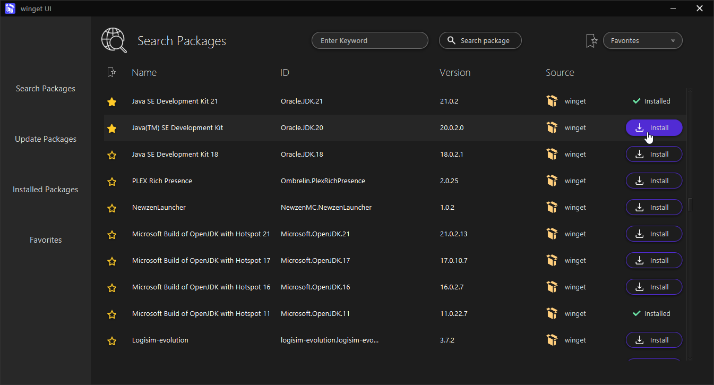
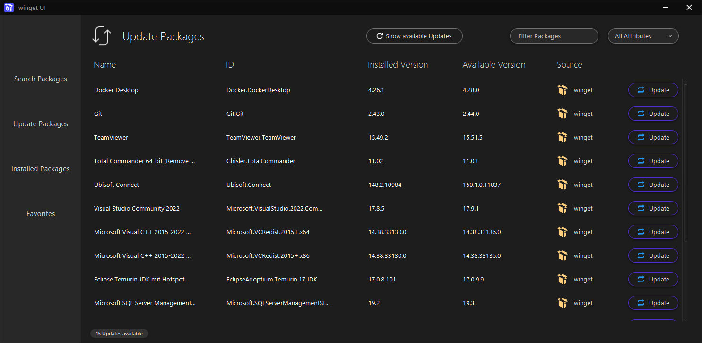
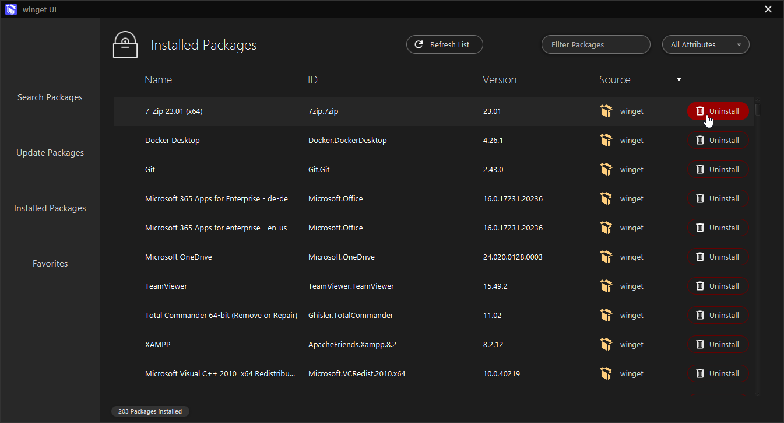
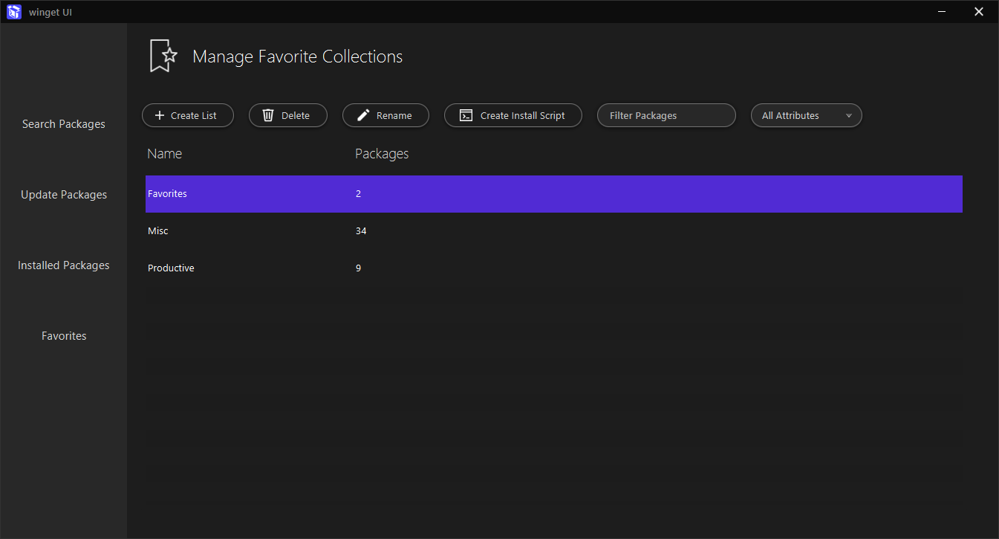
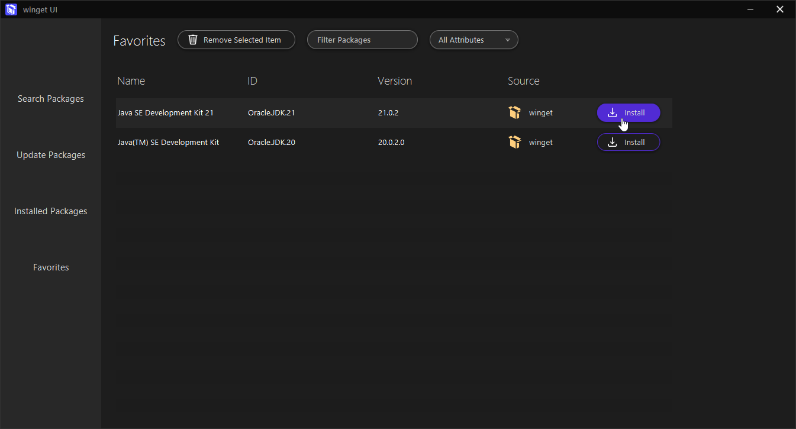

<!-- LOGO AND TITLE -->

 

    
  <h3 align="center">OOP2 Project: wingetUI</h3>

<!-- PROJECT DESCRIPTION -->
# About The Project

More or less simple Application with UI for using winget Package Installer.
Instead of opening PowerShell or Prompt and type every command, the goal is to have a UI which is easy to use.

This project is intended to implement the contents of the course IN212 "object oriented programming 2".

### The Application is built with
* [![Java][Java]][Java-url]
* [![JavaFX][JavaFX]][JavaFX-url]

# Handcrafted with love ❤️
## Search software you want to install
- Just type in a keyword and search for software packages.
- Easy and fast install by clicking the install button.
- Save or remove a package of your choice to favorites by selecting a list in the dropdown and hitting the ⭐ icon.

## Get updates for your installed software
- Update installed software quick and easy with a button click.

## Manage installed software
- Easy list and uninstall software on your computer.

## Create favorite lists to store and export your favorite software
- Create custom favorite lists to store your favorite software packages nice and ordered.
- Export your lists to an install script which can be executed without wingetUI to quickly set up a machine with the software needed.

## Manage packages in your custom favorite list
- Install a package directly from one of your favorites lists.

<!-- PROJECT CONDITIONS -->
# Project terms of reference

- a) Create at least four unit tests that check important parts of your application logic

- b) Enumeration type with Enum

- c) Use at least three of the following techniques: Inheritance, casting, interfaces, abstract classes or generics.

- d) Collections and sorting

- e) Certain data should be serialized or stored by the user (e.g. with Java serialization / without external DB), so that they are still available after restarting the application.

- f) Use the possibilities of exceptions purposefully, in order to handle exceptions in your application cleanly. Make sure that an error can be analyzed in detail with the help of log data.

- g) The project should be delivered as a Maven project and can be generated via the build process of Maven. An already compiled and directly executable version of the program should also be included in the delivery. Use packages to structure your classes according to a chosen architecture approach.

<!-- MARKDOWN LINKS & IMAGES -->
<!-- https://www.markdownguide.org/basic-syntax/#reference-style-links -->
[Java]: https://img.shields.io/badge/java-000000?style=flat&logo=appveyor
[Java-url]: https://www.java.com/de/
[JavaFX]: https://img.shields.io/badge/javaFX-20232A?style=flat&logo=appveyor
[JavaFX-url]: https://www.oracle.com/ch-de/java/technologies/javase/javafx-overview.html